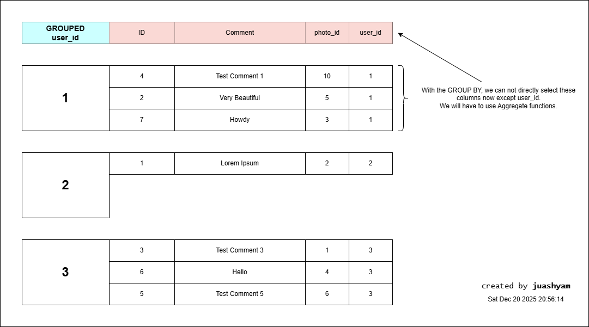

# SQL Joins, Group By, and Aggregates

## What is it?
This note covers join operations, grouping, and aggregate functions in SQL, which are essential for combining and summarizing data from multiple tables.

## JOINs
JOINs are used to combine rows from two or more tables based on a related column between them.

### Types of JOINs
- **INNER JOIN**: Returns records that have matching values in both tables.
- **LEFT JOIN (or LEFT OUTER JOIN)**: Returns all records from the left table, and the matched records from the right table. If no match, NULLs are returned for columns from the right table.
- **RIGHT JOIN (or RIGHT OUTER JOIN)**: Returns all records from the right table, and the matched records from the left table. If no match, NULLs are returned for columns from the left table.
- **FULL JOIN (or FULL OUTER JOIN)**: Returns all records when there is a match in either left or right table. Records without a match will have NULLs in the columns of the table without a match.

### Example of JOINs

#### Inner Join Example
```sql
SELECT contents, username
FROM comments
JOIN users ON comments.user_id = users.id;
```

#### Left Join Example
```sql
SELECT contents, username
FROM comments
LEFT JOIN users ON comments.user_id = users.id;
```

#### Right Join Example
```sql
SELECT contents, username
FROM comments
RIGHT JOIN users ON comments.user_id = users.id;
```

#### Full Join Example
```sql
SELECT contents, username
FROM comments
FULL JOIN users ON comments.user_id = users.id;
```

## GROUP BY
The `GROUP BY` statement is used in conjunction with aggregate functions to group the result-set by one or more columns.

In simple terms, it first creates set or group of each unique value in the specified column(s) and then assign each row to the appropriate group.



### Example of GROUP BY
```sql
SELECT user_id, COUNT(*) AS comment_count
FROM comments
GROUP BY user_id;
```

### Key Points:
- With GROUP BY, every column in the SELECT statement must either be included in the GROUP BY clause or be used in an aggregate function.
- We can not directly select non-aggregated columns without including them in the GROUP BY clause.


## Aggregate Functions
Aggregate functions perform a calculation on a set of values and return a single value. Common aggregate functions include:
- `COUNT()`: Returns the number of rows.
- `SUM()`: Returns the total sum of a numeric column.
- `AVG()`: Returns the average value of a numeric column.
- `MIN()`: Returns the smallest value.
- `MAX()`: Returns the largest value.

### Example of Aggregate Functions
```sql
SELECT user_id, COUNT(*) AS comment_count, AVG(rating) AS average_rating
FROM comments
GROUP BY user_id;
```

### KEY Points:
- Aggregate functions are often used with GROUP BY to summarize data.
- They can also be used without GROUP BY to perform calculations on the entire result set.
- We can not use aggregate function on a column and then select the same column without aggregation or grouping.


## HAVING Clause
The `HAVING` clause is used to filter records that work on summarized GROUP BY results. It is similar to the WHERE clause but is used for aggregate functions.

### Example of HAVING
```sql
SELECT user_id, COUNT(*) AS comment_count
FROM comments
GROUP BY user_id
HAVING COUNT(*) > 5;
```

### Key Points:
- `HAVING` is used to filter groups after the aggregation has been performed.
- It can include aggregate functions in its condition.